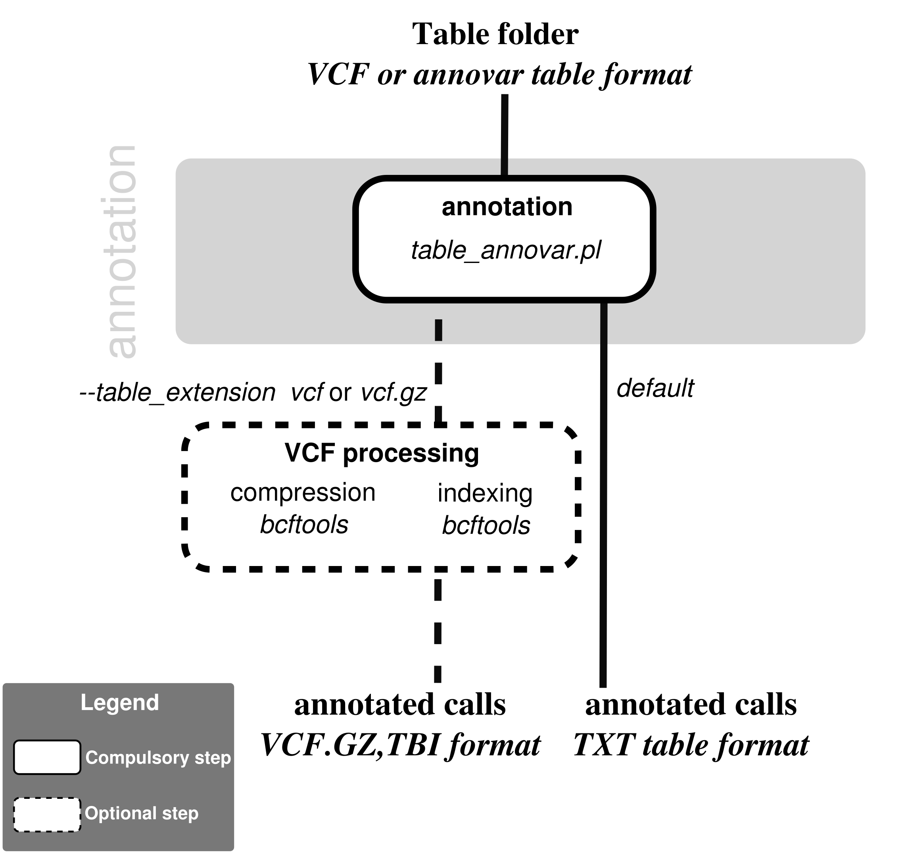

# table_annovar-nf
## Nextflow pipeline to annotate variant files with annovar

[](https://hub.docker.com/r/iarcbioinfo/table_annovar-nf/)
[](https://singularity-hub.org/collections/4381)



## Description
This pipeline runs table_annovar.pl on a folder full of vcf files.

#### Dependencies
1. This pipeline is based on [nextflow](https://www.nextflow.io). As we have several nextflow pipelines, we have centralized the common information in the [IARC-nf](https://github.com/IARCbioinfo/IARC-nf) repository. Please read it carefully as it contains essential information for the installation, basic usage and configuration of nextflow and our pipelines.

2. External software:  
  * [annovar](http://annovar.openbioinformatics.org/en/latest/)  
  * [bcftools](http://samtools.github.io/bcftools/bcftools.html), only used if input is in vcf format (option --table_extension vcf or vcf.gz) 

 **Caution**: the perl script `annotate_variation.pl` and `bcftools` have to be in your $PATH (note: in case you are using the conda, docker, or singularity profiles, bcftools will automatically be in your $PATH but not annotate_variation.pl). 

## Input

| Name      | Description   |
|-----------|---------------|
| `--table_folder`    | Folder containing tables to process |
 

## Parameters

  * #### Optional

| Name      | Default value | Description     |
|-----------|---------------|-----------------|
| `--output_folder`    |  `.`  | Folder to output resulting compressed vcf |
| `--annovar_params`     |  `See below` | Parameters given to table_annovar.pl |
| `--cpu`    |  1  |    Number of cpus to use |
| `--mem`    |  4  |  Size of memory used for mapping (in GB) |
| `--annovar_db` |Annovar_db  |  Folder with annovar databases |
|  `--buildver` | hg38 | Version of genome build |
| `--table_extension` | tsv | Extension of input tables |
| `--annot` | hg38_ensGene.txt | Path to annovar transcript annotation file | 
| `--annot_mrna` | hg38_ensGeneMrna.fa | Path to annovar transcript annotation fasta file |
 
The default annovar params are: `-protocol ensGene, exac03nontcga,esp6500siv2_all,1000g2015aug_all,gnomad211_genome,gnomad211_exome,clinvar_20190305,revel,dbnsfp35a,dbnsfp31a_interpro,intervar_20180118,cosmic84_coding,cosmic84_noncoding,avsnp150,phastConsElements100way,wgRna -operation g,f,f,f,f,f,f,f,f,f,f,f,f,f,r,r -otherinfo`, which imply that the corresponding annovar databases are installed. You can specify any other options using the annovar_params option.

  * #### Flags

Flags are special parameters without value.

| Name      | Description     |
|-----------|-----------------|
| `--help`    | Display help |

## Usage

Simple use case example:
```bash
nextflow run iarcbioinfo/table_annovar-nf -r v1.1 -profile singularity --table_folder VCF/ --table_extension vcf
```

To run the pipeline without singularity just remove "-profile singularity". Alternatively, one can run the pipeline using a docker container (-profile docker) the conda receipe containing all required dependencies (-profile conda). 

Note that because due to licensing considerations, annovar has to be installed locally and cannot be included in a container, the path to table_annovar.pl needs to be in the $PATH environment variable and needs to be mounted (e.g., using nextflow option singularity.runOptions = "-B /home/bin" and adding /home/bin to environment variable SINGULARITYENV_APPEND_PATH with nextflow option singularity.envWhitelist="SINGULARITYENV_APPEND_PATH").


## Output
  | Type      | Description     |
  |-----------|---------------|
  | file_multianno.txt       | Annovar tables |
  | file_multianno.vcf.gz, file_multianno.vcf.gz.tbi   | (optional, if --table_extension vcf or vcf.gz) Compressed and indexed annotated VCF files |
  | coding_change/file_coding_change.fa   | (optional, if exonic variant function is computed) fasta file with altered transcripts |

See info on output annovar format [here](http://annovar.openbioinformatics.org/en/latest/user-guide/input/).

## Contributions

  | Name      | Email | Description     |
  |-----------|---------------|-----------------|
  | Nicolas Alcala*    | alcalan@iarc.fr | Developer to contact for support |
  | Tiffany Delhomme    | delhommet@students.iarc.fr | Developer |


